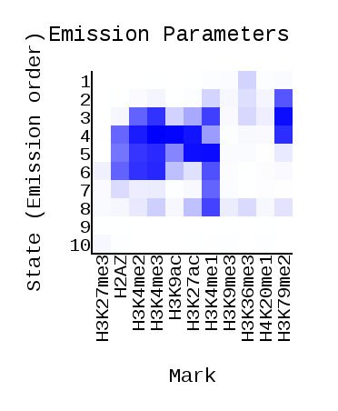
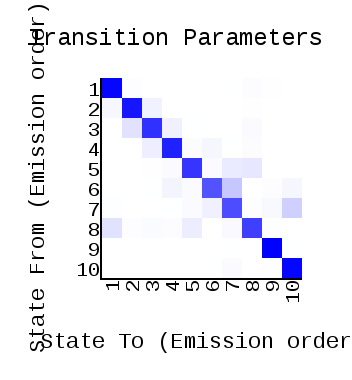
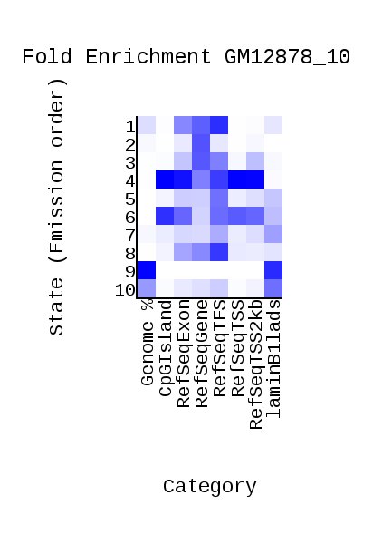
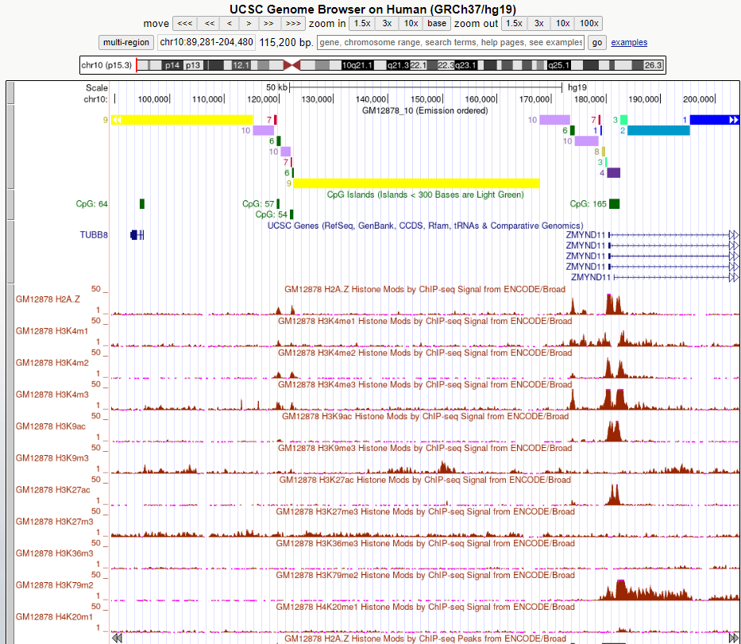
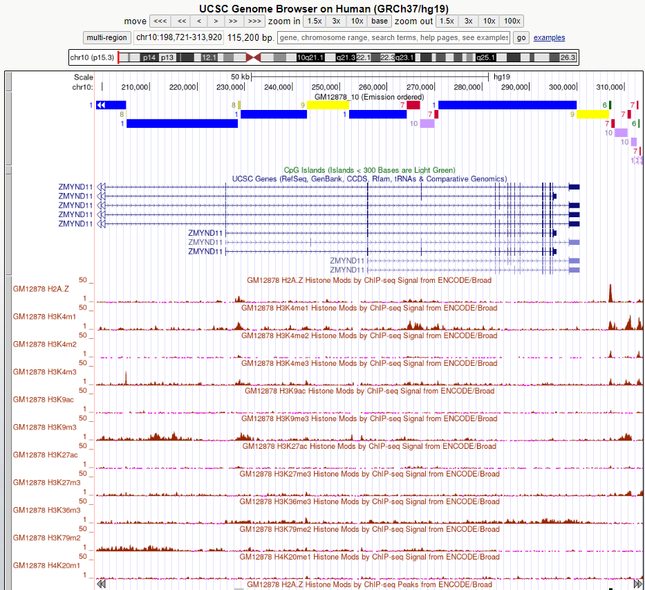
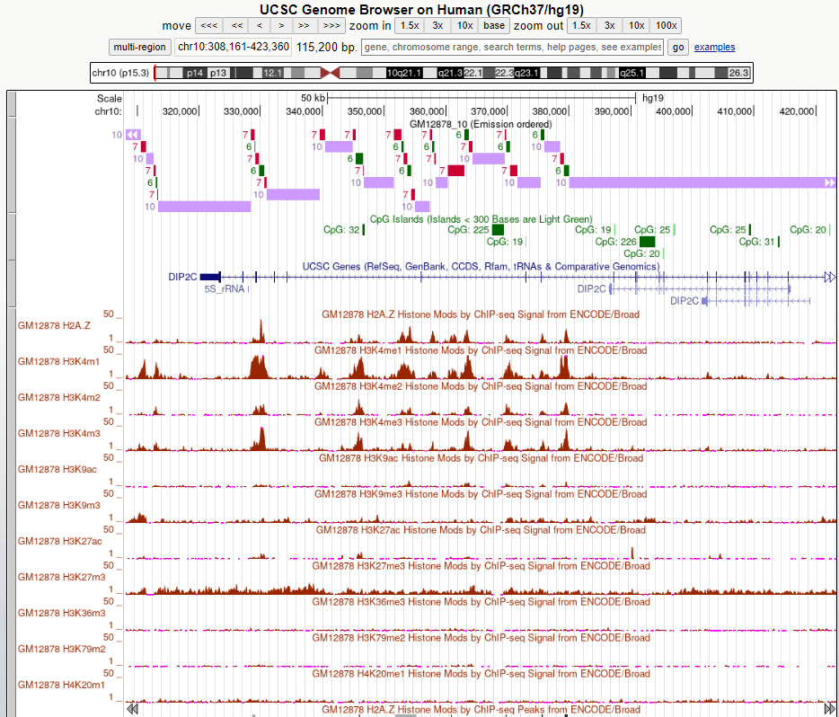
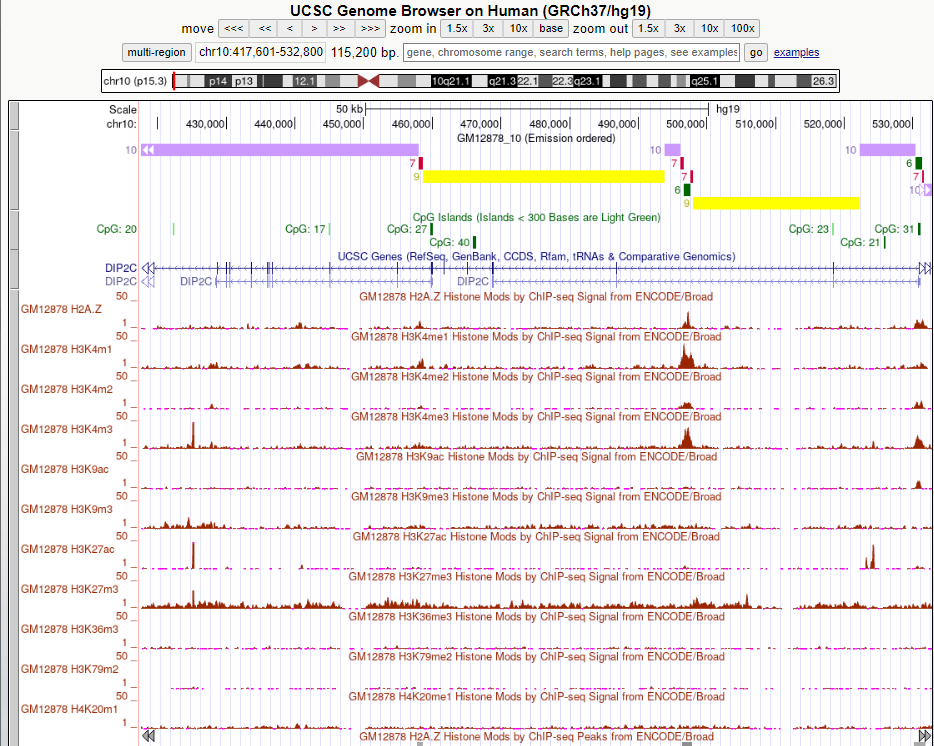
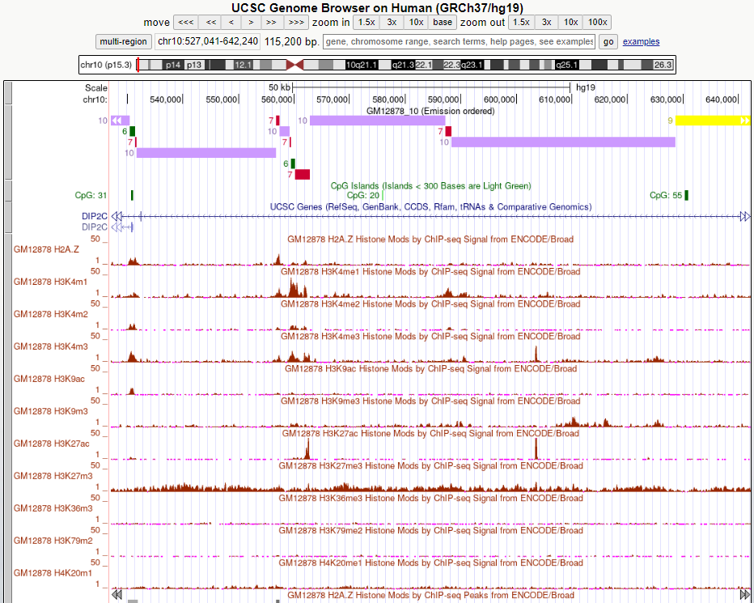
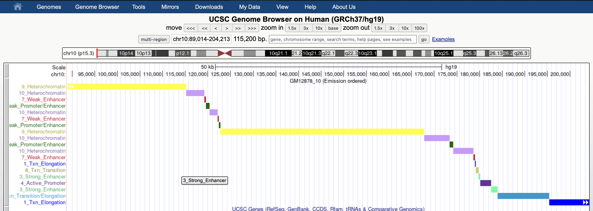

# hse24_hw3_chromhmm
## Colab: 
https://github.com/prettycrewcutyulia/hse24_hw3/blob/main/ДЗ3_Гудошникова.ipynb

Клеточная линия в задании ChIP-seq: GM23338

Так как клеточной линии GM23338 нет среди доступных, выбрана клеточная линия GM12878 для работы.

Клеточная линия: GM12878

Гистоновые метки:

| Histone modification | tableName | File |
| - | - | - |
| H2AZ | wgEncodeBroadHistoneGm12878H2az | wgEncodeBroadHistoneGm12878H2azStdAlnRep1.bam |
| H3K27ac | wgEncodeBroadHistoneGm12878H3k27ac | wgEncodeBroadHistoneGm12878H3k27acStdAlnRep1.bam |
| H3K27me3 | wgEncodeBroadHistoneGm12878H3k27me3 | wgEncodeBroadHistoneGm12878H3k27me3StdAlnRep1.bam |
| H3K36me3 | wgEncodeBroadHistoneGm12878H3k36me3 | wgEncodeBroadHistoneGm12878H3k36me3StdAlnRep1.bam |
| H3K4me1 | wgEncodeBroadHistoneGm12878H3k04me1 | wgEncodeBroadHistoneGm12878H3k04me1StdAlnRep1V2.bam |
| H3K4me2 | wgEncodeBroadHistoneGm12878H3k4me2 | wgEncodeBroadHistoneGm12878H3k4me2StdAlnRep1.bam |
| H3K4me3 | wgEncodeBroadHistoneGm12878H3k04me3 | wgEncodeBroadHistoneGm12878H3k04me3StdAlnRep2V2.bam |
| H3K79me2 | wgEncodeBroadHistoneGm12878H3k79me2 | wgEncodeBroadHistoneGm12878H3k79me2StdAlnRep1.bam |
| H3K9ac | wgEncodeBroadHistoneGm12878H3k9ac | wgEncodeBroadHistoneGm12878H3k9acStdAlnRep1.bam |
| H3K9me3 | wgEncodeBroadHistoneGm12878H3k9me3 | wgEncodeBroadHistoneGm12878H3k9me3StdAlnRep1.bam |
| H4K20me1 | wgEncodeBroadHistoneGm12878H4k20me1 | wgEncodeBroadHistoneGm12878H4k20me1StdAlnRep1.bam |

Контроль:
| Control | tableName | File |
| - | - | - |
| Control | wgEncodeBroadHistoneGm12878Control | wgEncodeBroadHistoneGm12878ControlStdAlnRep1.bam |

## ChromHMM
Вручную создан текстовый файл cellmarkfiletable.txt, в котором указаны тип клеток, гистоновые метки, а также соответствующие .bam файлы для эксперимента и контроля. Файл загружен в папку data.

Файлы из выдачи ChromHMM, загружены в папку data.

 
  
  

## UCSC Genome Browser
Настроен Custom Track с dense.bed файлом из выдачи ChromHMM.

## Эпигенетические типы

| Тип | Эпигенетические метки | Типичное расположение | Название эпигенетического типа |
| - | - | - | - |
| 1 | H3K36me3 (dim) | RefSeq Gene, RefSeq Exon, RefSeq TES | Transcriptional elongation |
| 2 | H3K79me2, H3K4me1 (dim) | RefSeq Gene | Transcriptional transition/elongation |
| 3 | H3K79me2, H3K4me1, H3K4me3, H3K4me2, H3K27ac | RefSeq Gene, RefSeq TES | Strong Enhancer |
| 4 | H3K27ac, H3K4me3, H3K9ac, H3K79me2, H3K4me2, H2AZ, H3K4me1 | CpG Island, RefSeq Gene, RefSeq Exon, RefSeq TSS, RefSeq TSS2kb, RefSeq TES | Active Promoter |
| 5 | H3K27ac, H3K4me1, H3K4me3, H3K4me2, H2AZ, H3K9ac | RefSeq TES | Strong Enhancer |
| 6 | H3K4me3, H3K4me2, H3K4me1, H2AZ | CpG Island, RefSeq Exon, RefSeq TSS, RefSeq TSS2kb, RefSeq TES | Weak Promoter/Enhancer |
| 7 | H3K4me1, H2AZ (dim) | lamin ilands | Weak Enhancer |
| 8 | H3K4me1, H3K27ac, H3K4me3 (dim), H3K36me3 (dim), H3K79me2 (dim) | RefSeq Gene, RefSeq Exon, RefSeq TES | Transcriptional transition |
| 9 | H3K27me3 (dim) | lamin ilands | Heterochromatin |

## Бонусная часть задания
Новый файл GM12878_10_dense_new.bed приложен в папке data.

